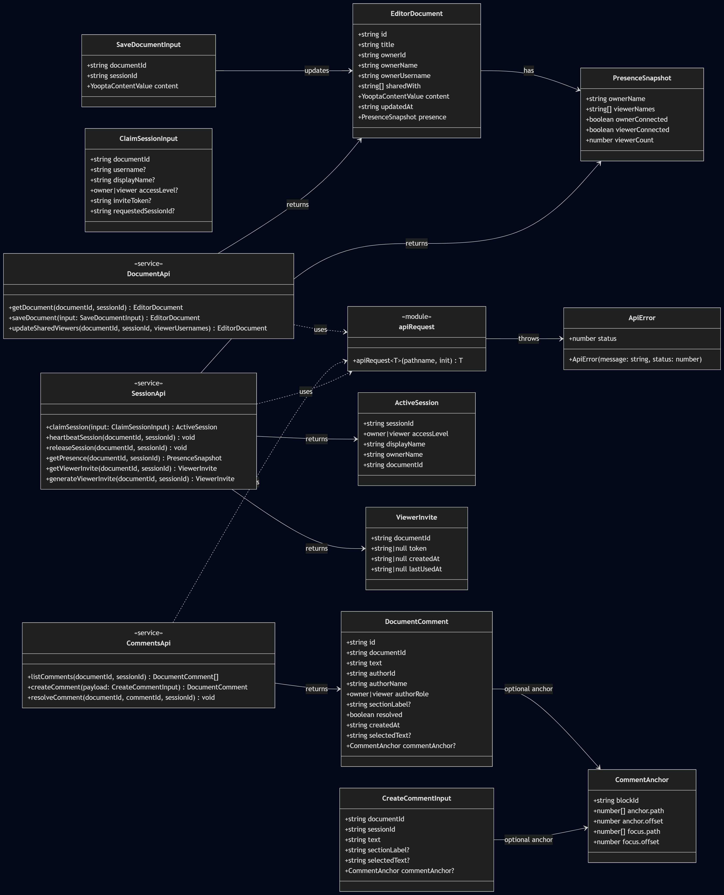
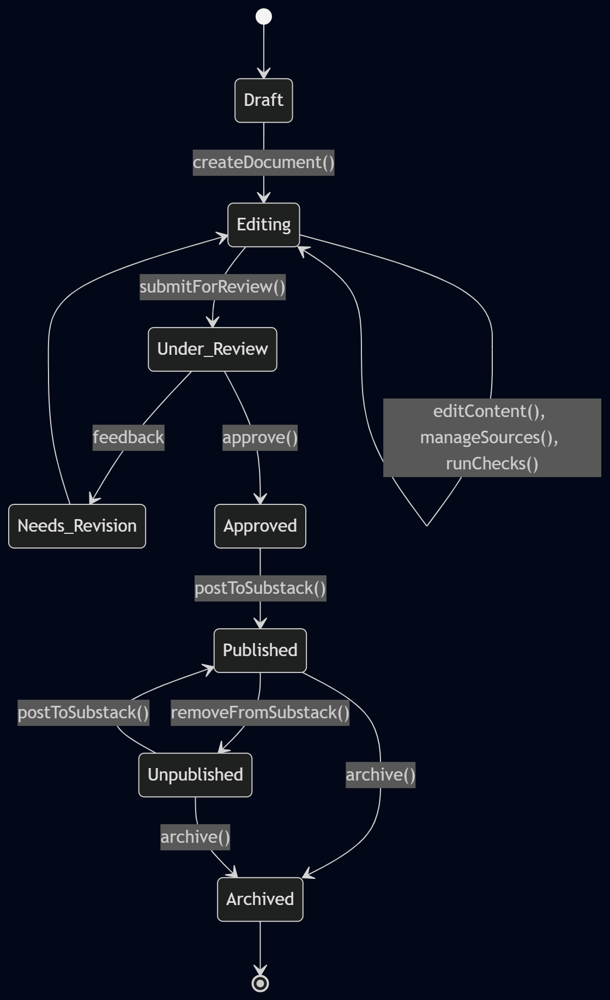

# project2-group6
Ray, Faith, Suryash, and George

# Sprint plan
https://docs.google.com/document/d/1ovA4SQM1nDByxMvQ0C5xEs1JmpQgkh4uJZZ-DU14AzU/edit?usp=sharing

## Pitch
### Overview

This project delivers a collaborative, web-based writing environment tailored specifically for journalists and editors, streamlining the process of composing, sourcing, and publishing stories. The application supports two primary user roles: writers and editors. Writers can create and manage documents from their dashboard, while editors are invited collaborators with read-only access and commenting capabilities.

The platform integrates a built-in research and citation system. Users can search or paste links directly into the sidebar, automatically generating editable citations categorized by source type (e.g., website, book, interview). An embedded browser allows in-app viewing of non-commercial sources, while commercial links open externally. Writers can organize sources, quotes, and media efficiently within each document.

The rich text editor includes formatting tools, image insertion, commenting, and document sharing. A real-time collaboration panel displays active users, roles, and access modes. Only document owners can edit and publish content, with direct publishing supported via WordPress integration.

Overall, the app centralizes writing, research, collaboration, and publishing into a single workflow, reducing friction for newsroom teams and enabling more organized, transparent, and efficient content production.

## Class Diagram
[]

## Use Case Diagram
[Visit the Mermaid Diagram here](https://mermaid.ink/img/pako:eNptUktOwzAUvIr1Vq6UlsTNx82CTUFsioQACQnCwk0eTdQ6jpwEEaoeghOw4YAcASdRU6R0Zb8Zz7yx_fYQqwQhhI0WRUpW91FOiIgrpR36EsHv99cPedJZhTqC18lAsoG8TjJT92RLl_W6t3poygplDxISK1lQulSFVCVOJke40iLeUvrYLuRB1TrG8sQW9ZrSu3q9y0rjZ9o0Jy5OsVUu28VwzQ4vbrSQUujTGTTZKF2heMcu52CNedJv-puS6fSySzgCu3wj1OQay9sg_1B2Vs_O6HuszToCO1OwzOdkCYSVrtECiVqKtoR9ezqCKkWJEYRmmwi9jSDKD0ZTiPxZKXmUaVVvUgjfxK40VV0kosKrTJi_kgOqzbugXqo6ryAMfLszgXAPHxAyx59x13ED2-U-9x3OLWgg9PjM9ZkbuJzNuTNnrnew4LPra884Y9z1Ai-w7cBb8IUF2E3LbT9y3eQd_gAcusvy?type=png)

## Sequence Diagram

## State Diagram 

